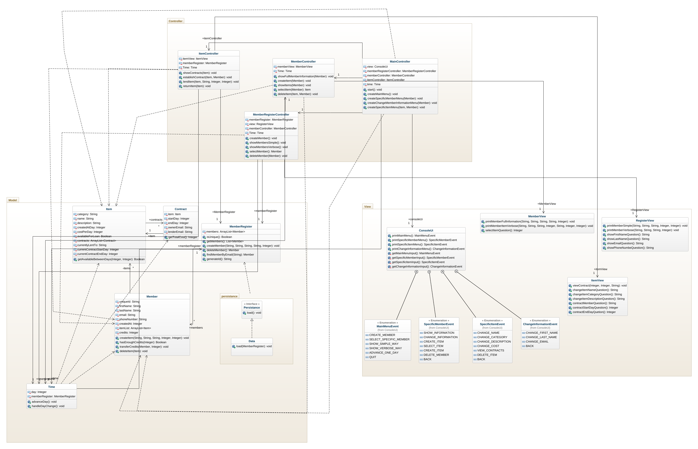

# Boatclub OO-Design
This document describes the design according to the requirements presented in assignment 2.

## Architectural Overview
The application uses the model-view-controller (MVC) architectural pattern. The view is passive and gets called from the controller. The view may only read information from the model, not directly change it.

## Detailed Design
### Class Diagram
Please provide at least one class diagram according to the assignment requirments.

Couldnt put arrows and show direction of association in GenMyModel, supposed to be arrows like: controller -> model, controller -> view etc.

### Sequence Diagram
Please provide at least one sequence diagram according to the assignment requirments.
[](https://mermaid.live/edit#pako:eNq1VN9P20AM_lc8S0hFXFGBppR7YJoGiKKBNqbtYcrLLec2pyV35XIR66r-73N-wdYCYoj5JXY-f599sXNLTJwmlFjQTUk2oROjZl7lsQW2984G77KMPFwqY_8I-8fHO3_BlH8nf00zUwTy94CExJMK1OC97U3dR4h1ha-GbqHDqkBCkbrbM-OLcKVy-lRSEYyzr6T7Qf0X2dNcmeyVNT-mztJVWRHXlTcY0Geh_vOmldfIxE6dz9VL-r3kdcrWUtaWYNqNT0CmOo-qjyRgfn-utvBDgs36wcO1ZmTJc7WJ7r1UwhRfrOH_obfZlQCj_01WguUZPOPs9qkCT_artG71m0fL39qCd5lJqKLWjoQLl1oBibKwcCWkpDyP_O1dOsOFrdelzT83jYSASc2qGUx98zhlAlPiHmfVyNu0zlBgTrxYRvONs6ywGENKOcUo2dXK_4gxtivOK-eaZ3iqTXAeZfAlCVRlcJ8XNuniJqe9sVBOVVbw27myKJf4E2UU7R5VNh4cRINxNDwUuEC5N4x2B0fRYDQ-PNgfDYejlcBfzrHAXk3-VvtVhdVv3HW9Hg)

The mermaid version of sequence diagram creation is not optimal and i couldnt get correct naming etc.

